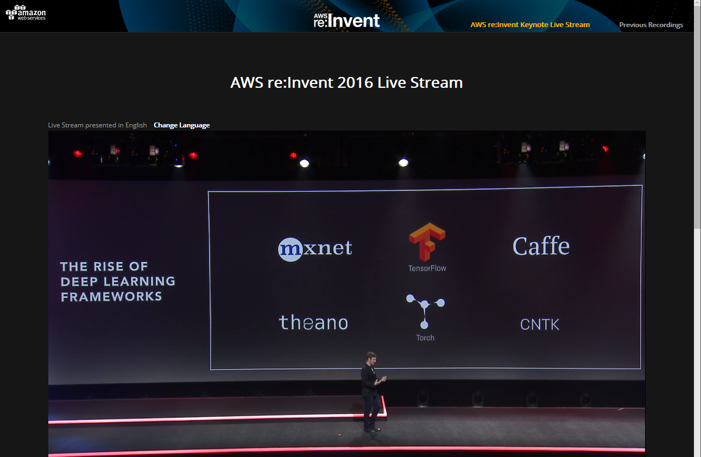

# Deep Learning Frameworks

## Scalability Comparison Scripts for Deep Learning Frameworks

- https://github.com/awslabs/deeplearning-benchmark

## The Rise of Deep Learning Frameworks

- https://github.com/dmlc/mxnet
- https://github.com/tensorflow/tensorflow
- https://github.com/BVLC/caffe
- https://github.com/Theano/Theano
- https://github.com/torch/torch7
- https://github.com/Microsoft/CNTK

